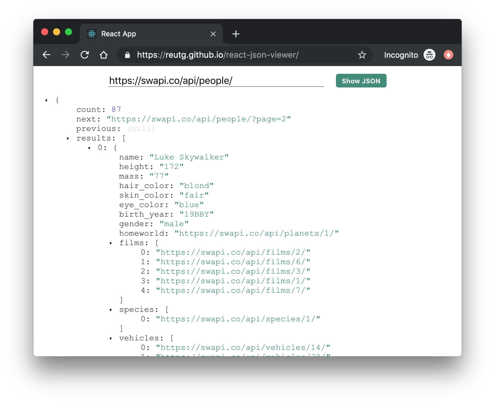

# React JSON Viewer
A simple React application that renders a JSON object tree from a remote url.

**Demo**: https://reutg.github.io/react-json-viewer

## Running the project
1. Clone the repo.
1. Run `npm install`.
1. Run `npm start`.